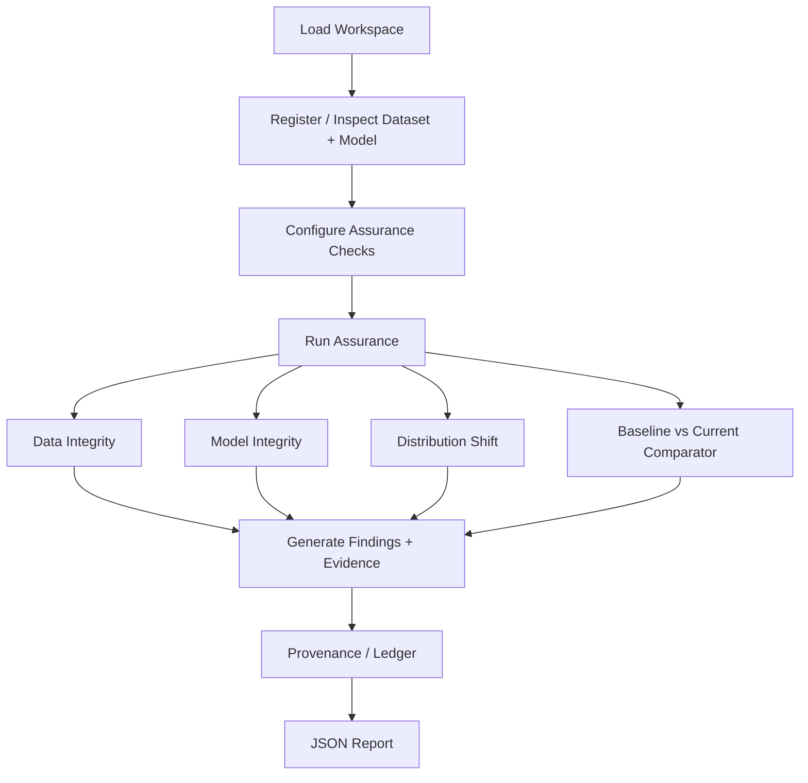

# NETRA-Guard — Unified Computer-Vision Assurance Framework

**SIH Problem Statement:** SIH26228

NETRA-Guard is an **offline-first computer-vision assurance and evidence platform** designed to evaluate the integrity, provenance, distribution stability, and assurance changes of computer-vision assets before consequential use.

> NETRA-Guard is an assurance/evidence layer around existing computer-vision workflows, not another object-detection or classification model.

---

## Quick Start

Get the project running locally in a few steps:

```bash
git clone <repository-url>
cd NethraGuard
npm install
npm run dev
```

## Current Status

**The frontend prototype is already structured and functional (using demo data).** The next major task is integration with the backend API and AI/ML evaluation models. 

> The frontend is currently the main interface contract for backend and AI/ML integration.

---

## 1. Project Overview

NETRA-Guard provides an offline assurance layer for CV systems by checking:
* Dataset integrity
* Model integrity
* Distribution shift
* Baseline vs current assurance changes
* Provenance
* Evidence
* Reproducibility
* Structured reporting

**The core analyst question this platform answers is:**
> What changed, what evidence supports it, how certain is the finding, and what should be reviewed?

---

## 2. Core Workflow

The system is designed around a complete end-to-end analyst journey:



---

## 3. Current Frontend Status

The frontend prototype is fully structured around the workflow above. It includes:

* Analyst Overview / Dashboard
* Workspace & asset setup
* Dataset/model registration UI
* Assurance check configuration
* Run progress / execution flow
* Findings table and filters
* Finding detail view
* Evidence viewer
* Distribution Shift visualization
* Baseline vs Current Comparator
* Provenance Ledger / verification UI
* JSON report/export UI
* Controlled demo scenarios
* PASS / WARNING / FAIL / NOT RUN states
* Offline-first frontend structure
* Reusable components
* Centralized demo/mock data

The frontend currently uses mock/demo data until the corresponding backend APIs are connected.

---

## 4. Architecture

```text
React + TypeScript + Vite
          │
          ▼
      Frontend UI
          │
          ▼
   Local Backend / API (Pending)
          │
          ├── Data Integrity
          ├── Model Integrity
          ├── Distribution Shift
          ├── Comparator
          ├── Provenance
          └── Reporting
          │
          ▼
 Local Workspace / Artifacts / Database
```

---

## 5. Technology Stack

The current frontend is built with:
* **React 19**
* **TypeScript**
* **Vite**
* **Tailwind CSS (v4)**
* **Recharts** (for data visualization)
* **React Router DOM** (for navigation)
* **Lucide React** (for icons)
* **Oxlint** (for linting)

---

## 6. Frontend Structure

The repository follows this structure under `src/`:

* `components/`: Reusable UI components (buttons, cards, tables). Should not contain page-specific business logic.
* `pages/`: The main route views (Overview, Workspace, Findings, etc.).
* `hooks/`: Custom React hooks for state and data fetching.
* `services/`: API integration and data fetching methods.
* `types/`: TypeScript interface and type definitions.
* `utils/`: Helper functions and formatters.
* `assets/`: Static assets like images or global styles.

To extend the app, use existing components where possible and keep types strongly defined in `types/`.

---

## 7. Main Frontend Modules

* **Dashboard (Overview):** Shows overall assurance state, summary findings, latest run, baseline/current comparison, recent runs, and evidence previews.
* **Workspace:** Handles dataset, model, baseline, asset metadata, and hash/identity information.
* **Run Configuration:** Supports configuring Data Integrity, Model Integrity, Distribution Shift, Comparator, Thresholds, and controlled demo scenarios.
* **Run Progress:** Shows execution stages and states.
* **Findings:** Displays Finding ID, Category, Severity, Status, observed value, threshold, and affected artifact/sample.
* **Finding Details:** Displays explanation, method, evidence, certainty/confidence, limitations, remediation, and the linked run.
* **Distribution Shift:** Displays reference/current comparison, shift score, threshold, alert level, statistics/charts, method, and caveats.
* **Comparator:** Shows baseline run, current run, metric deltas, new findings, cleared findings, unchanged findings, and status changes.
* **Provenance:** Shows Run ID, timestamp, dataset hash, model hash, configuration, baseline relationship, and verification state.
* **Reports:** JSON reporting is mandatory. (HTML/PDF are stretch goals).

---

## 8. Status Model

The system uses standard statuses consistently:
* `PASS`
* `WARNING`
* `FAIL`
* `NOT_RUN`

**Important:**
* Do not show PASS when a check was skipped.
* Do not hide unavailable checks.
* Do not convert every result into an arbitrary numerical "trust score."

---

## 9. Backend/API Integration Contract

Backend APIs should be designed around the existing frontend workflow. The following are **proposed API conventions** to support the UI:

```text
Workspace / Assets
GET    /api/workspace
POST   /api/assets/dataset
POST   /api/assets/model

Run Management
POST   /api/runs
GET    /api/runs/{runId}
GET    /api/runs/{runId}/status

Findings & Evidence
GET    /api/runs/{runId}/findings
GET    /api/findings/{findingId}
GET    /api/runs/{runId}/evidence

Analysis Modules
GET    /api/runs/{runId}/distribution-shift
GET    /api/runs/{runId}/compare

Provenance & Reports
GET    /api/runs/{runId}/provenance
GET    /api/reports/{runId}
```

---

## 10. Expected Finding Data

The API should return findings in a structured format. Recommended schema:

```json
{
  "id": "FIND-001",
  "category": "DATA_INTEGRITY",
  "severity": "WARNING",
  "status": "WARNING",
  "title": "Duplicate samples detected",
  "description": "...",
  "observed": 12,
  "threshold": 5,
  "artifact": "dataset",
  "sample": "sample-001",
  "method": "deterministic duplicate check",
  "evidence": [],
  "limitations": [],
  "remediation": "...",
  "runId": "RUN-001"
}
```

API responses must remain consistent, typed, documented, and easy for the frontend to consume.

---

## 11. Important Rules for Contributors

### Do not create arbitrary trust scores
NETRA-Guard should be evidence-driven.

### Deterministic checks must be identified as deterministic
For example: *Rule-based / deterministic check*.

### ML results must explain themselves
Where ML/statistical methods are used, expose the raw score, threshold, method, calibration/context, and limitations.

### Hash mismatch wording
A model hash mismatch means: *The current artifact differs from the registered baseline.* It does NOT by itself prove malicious tampering.

### Distribution-shift thresholds
Prototype thresholds are controlled demo thresholds and should not be represented as universal production thresholds.

### Offline-first
Avoid unnecessary cloud/external dependencies.

### No fake evidence
All displayed metrics/evidence should eventually come from actual computations or clearly labelled controlled demo data.

---

## 12. Controlled Demo Scenarios

The prototype demonstrates three core demo scenarios to validate the workflow:

* **Scenario 1 — Dataset anomaly:** A controlled dataset integrity issue is introduced and detected.
* **Scenario 2 — Model hash mismatch:** The current model artifact differs from the registered baseline and the system produces an evidence-backed finding.
* **Scenario 3 — Distribution shift:** Reference and current image batches differ sufficiently according to the selected method/threshold and the system reports the result.

---

## 13. Local Setup

**Prerequisites:** 
- Node.js (v20+ recommended)
- Python 3.10+

### Starting the Backend (FastAPI)
The Python backend uses `uvicorn` and expects the `backend` folder to be its application root. Run these commands from the root of the repository:

```bash
# Create and activate a virtual environment (Windows)
python -m venv .venv
.\.venv\Scripts\Activate.ps1

# Install requirements
pip install -r backend/requirements.txt

# Start the backend server (ensure you use the --app-dir flag)
python -m uvicorn app.main:app --app-dir backend --host 127.0.0.1 --port 8000 --reload
```

### Starting the Frontend (React/Vite)
Open a new terminal window:

```bash
# Install dependencies
npm install

# Run the development server
npm run dev

# Run the linter
npm run lint

# Build the project
npm run build
```

---

## 14. Development Guidelines

* **Create a feature branch** before making changes.
* **Avoid directly modifying unrelated modules.**
* **Reuse existing components** (found in `src/components`).
* **Keep TypeScript types consistent.**
* **Keep API contracts documented.**
* **Do not hardcode backend assumptions** throughout the UI.
* **Keep mock/demo data separate** from production API services where possible.
* **Do not remove existing working workflow** without discussing it with the team.
* **Test the complete analyst journey** after major changes.

---

## 15. Current Work vs Pending Work

| Area               | Current State          | Next Step                     |
| ------------------ | ---------------------- | ----------------------------- |
| Frontend UI        | Implemented/prototyped | API integration               |
| Workspace          | UI ready               | Backend asset registration    |
| Data Integrity     | UI ready               | Real checks                   |
| Model Integrity    | UI ready               | Hash/metadata service         |
| Distribution Shift | UI ready               | Real computation              |
| Comparator         | UI ready               | Backend comparison logic      |
| Findings           | UI ready               | Real finding generation       |
| Evidence           | UI ready               | Real evidence pipeline        |
| Provenance         | UI ready               | Local ledger implementation   |
| JSON Report        | UI ready               | Connect to real run data      |
| Backend API        | Pending/in progress    | Implement contract            |
| AI/ML              | Pending/in progress    | Integrate explainable methods |

---

## 16. Definition of Done

The target system should demonstrate the full journey:

```text
Load Demo Workspace
        ↓
Inspect Dataset + Model
        ↓
Configure Checks
        ↓
Run Assurance
        ↓
View Findings
        ↓
Inspect Evidence
        ↓
Compare Baseline vs Current
        ↓
Verify Provenance
        ↓
Export JSON Report
```

Ultimately, it must successfully detect dataset anomalies, model hash mismatches, and distribution shifts, alongside baseline comparison, provenance tracking, evidence-backed findings, and JSON reporting.
