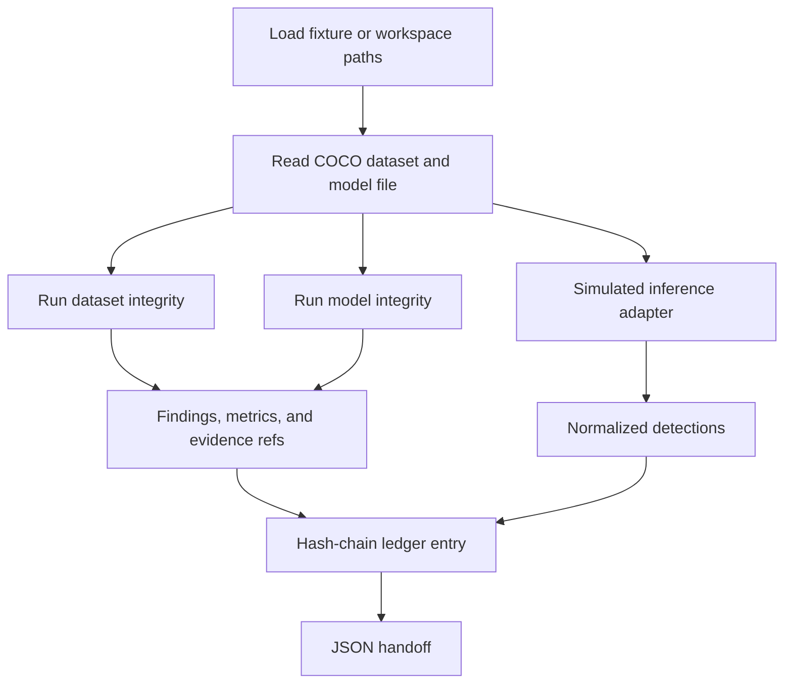

# NETRA-Guard — Assurance Core

**SIH Problem Statement:** SIH26228

This package is the **offline dataset, model, and inference assurance core** for NETRA-Guard. It checks whether a computer-vision dataset and model artifact are structurally valid, whether the model file matches a registered baseline, and whether a run can produce a stable, normalized detection list.

> NETRA-Guard is an assurance/evidence layer around existing computer-vision workflows, not another object-detection or classification model.

---

## Quick Start

From the repository root:

```bash
cd backend
python3 -m venv .venv
source .venv/bin/activate
pip install -r requirements.txt
pytest
```

Print one full run as JSON:

```bash
python -m assurance.scenarios NONE
```

## Current Status

**Dataset checks, model fingerprinting, a simulated inference contract, and hash-chain verification are implemented and tested.** Distribution shift and the baseline-versus-current comparator are not implemented in this package. They are returned as `NOT_RUN`.

> This package is the computation contract for those later modules. It does not replace the React app.

---

## 1. Project Overview

This package answers three questions before a computer-vision asset is used:

* Is the dataset structurally valid?
* Does the model file match the registered baseline?
* Can the run emit a stable, normalized detection list, with a tamper-evident record of what was checked?

It covers:

* Dataset integrity (COCO JSON)
* Model integrity (SHA-256 fingerprint)
* Normalized inference output (simulated for the demo stand-in)
* Provenance hash chain
* Evidence-backed findings
* Controlled dataset-anomaly and model-mismatch scenarios

Distribution shift, baseline comparison, and the dashboard stay outside this package.

**The question this package answers is:**

> Is this dataset readable and well formed, does this model file match the baseline, and what evidence supports that result?

---

## 2. Core Workflow



`distribution_shift` and `comparator` are included in the result as `NOT_RUN` so a caller can see that they were not executed.

---

## 3. What This Package Does

* Parses one annotation format: COCO JSON (`images`, `annotations`, `categories`)
* Checks missing files, corrupt images, malformed JSON, invalid class ids, and bounding boxes
* Detects exact SHA-256 duplicates
* Profiles class counts, image size, and simple imbalance or resolution warnings
* Hashes a model file and compares it with the baseline manifest
* Refuses to load pickle weights
* Returns fixed, labeled simulated detections for the demo `.bin` stand-in
* Builds and verifies an append-only hash chain
* Ships a clean fixture, a dataset-anomaly fixture, and a model-mismatch fixture

The bundled images are small synthetic PNGs that use the COCO label format. They are not the public COCO photo collection.

---

## 4. Architecture

```text
Caller (tests, a future local API, or another module)
          │
          ▼
   assurance/
          │
          ├── data_integrity.py
          ├── model_integrity.py
          ├── inference.py
          ├── ledger.py
          └── scenarios.py
          │
          ▼
 fixtures/  (datasets, model stand-ins, expected JSON)
```

There is no web server in this package. A future API should call these functions and store the JSON. It should not reimplement the checks.

---

## 5. Technology Stack

* **Python 3.11+** (developed on 3.14)
* **Pydantic** for the result models
* **Pillow** for image decode
* **pytest** for the checks
* **hashlib** (standard library) for SHA-256

ONNX Runtime, Ultralytics, and PyTorch are not dependencies. Those formats are not claimed as supported.

---

## 6. Package Structure

* `assurance/schemas.py`: Shared status, finding, detection, and ledger models.
* `assurance/hashing.py`: SHA-256 and canonical JSON.
* `assurance/data_integrity.py`: COCO dataset checks.
* `assurance/model_integrity.py`: Model fingerprint, baseline comparison, and the adapter interface.
* `assurance/inference.py`: Deterministic detection fallback.
* `assurance/ledger.py`: Hash-chain create and verify.
* `assurance/scenarios.py`: `NONE`, `DATA_ANOMALY`, `MODEL_MISMATCH`, and the skipped shift scenario.
* `fixtures/`: Tiny offline datasets, model stand-ins, and handoff JSON.
* `tests/`: Pytest coverage for the checks, ledger, and scenarios.
* `docs/NETRA_Guard_Person2_Handover.pdf`: Integration brief for the shift and comparator work.

---

## 7. Main Modules

* **Dataset integrity:** Image readability, missing files, malformed annotations, invalid class ids, boxes outside the image, zero or negative box size, extreme aspect ratio, exact duplicates, class counts, and resolution outliers.
* **Model integrity:** SHA-256, byte size, extension, and comparison with `fixtures/baseline_manifest.json`. A match is `PASS`. A mismatch is `FAIL`. No baseline is `NOT_RUN`.
* **Inference:** For the demo `.bin` file, returns the same boxes every time and sets `simulated: true`. These boxes are not outputs of model weights.
* **Ledger:** Appends one entry per executed scenario and verifies the chain.
* **Scenarios:** One function, `run_scenario`, runs the dataset check, the model check, and inference, then appends a ledger entry.

---

## 8. Status Model

Each module uses:

* `PASS`
* `WARNING`
* `FAIL`
* `NOT_RUN`

Inside dataset and model checks:

* A `CRITICAL` or `HIGH` finding makes the module `FAIL`.
* Any other finding makes the module `WARNING`.
* No findings makes the module `PASS`.
* A check that did not run stays `NOT_RUN`.

**Important:**

* Do not show `PASS` when a check was skipped.
* Do not hide `NOT_RUN` modules.
* Do not convert results into an arbitrary numerical trust score.
* A hash mismatch means the file differs from the registered baseline. It does not prove malicious tampering.
* An exact duplicate does not prove poisoning.

---

## 9. Result Contract

Call `run_scenario` or the individual functions. Module JSON is snake_case:

```json
{
  "module": "data_integrity",
  "status": "FAIL",
  "metrics": {},
  "findings": [
    {
      "severity": "CRITICAL",
      "title": "Missing image file",
      "method": "Rule-based / deterministic check. ...",
      "observed_value": "missing",
      "threshold": "file must exist and be readable",
      "evidence_refs": [
        {
          "id": "missing-img_003.png",
          "sample_id": "img_003.png",
          "file_hash": null,
          "evidence_type": "missing_image"
        }
      ],
      "limitations": "A missing file is a structural dataset failure."
    }
  ]
}
```

Normalized detections:

```json
{
  "image_id": "img_001.png",
  "detections": [
    {
      "class_id": 1,
      "confidence": 0.91,
      "bbox_xyxy": [10, 10, 40, 30]
    }
  ]
}
```

Annotation boxes in COCO JSON are `[x, y, width, height]`. Detection boxes are `[x1, y1, x2, y2]`. Do not treat those arrays as the same format.

The React mock uses different field names (`observed`, `testMethod`, `Data Integrity`). Map them at the API boundary. Do not change this package to match the mock.

Functions:

```text
check_dataset(dataset_dir)
fingerprint_dataset(dataset_dir)
check_model(model_path, *, baseline_sha256, allowed_root)
run_inference(model_path, image_paths, *, allowed_root, config=None)
normalized_detections(result)
run_scenario(scenario, ledger=None, timestamp=None)
scenario_to_handoff(run)
append_entry(...)
verify_ledger(entries)
sha256_file(path)
canonical_json(payload)
```

---

## 10. Ledger

```text
current_hash = SHA256(canonical_json(entry_without_current_hash) + previous_hash)
```

The first previous hash is 64 zero characters. Canonical JSON uses sorted keys and no extra whitespace.

Entry fields match the provenance screen: `runId`, `sequence`, `timestamp`, `actorLabel` (`local-demo`), `datasetHash`, `modelHash`, `configHash`, `summaryHash`, `previousHash`, `currentHash`, `baselineRunId`.

`verify_ledger` returns `VALID`, or `FAILED` with `firstInvalidSequence`. Tamper demos must edit a copy of the chain, not the live fixture files.

---

## 11. Prototype Thresholds

These are demonstration thresholds, not deployment limits.

| Check | Rule | Status |
| --- | --- | --- |
| Exact duplicate | More than one file shares a SHA-256 | `WARNING` |
| Extreme aspect ratio | `max(width/height, height/width) > 8` | `WARNING` |
| Class imbalance | `max(count) / min(count) >= 4`, at least two classes | `WARNING` |
| Resolution outlier | Width or height more than 50% from the median, when at least 4 images decode | `WARNING` |
| Structural failure | Malformed COCO, missing or corrupt image, bad box, invalid class id, path escape | `FAIL` |

---

## 12. Controlled Demo Scenarios

| Scenario | What it uses | Result |
| --- | --- | --- |
| `NONE` | Clean dataset and baseline model file | Data `PASS`, model `PASS`, ledger `VALID` |
| `DATA_ANOMALY` | Duplicate image, missing `img_003.png`, out-of-bounds box, class id `99` | Data `FAIL`, model `PASS` |
| `MODEL_MISMATCH` | Clean dataset and altered model bytes | Data `PASS`, model `FAIL` |
| `DISTRIBUTION_SHIFT` | Not executed here | Every module `NOT_RUN` |

Run them with:

```bash
python -m assurance.scenarios NONE
python -m assurance.scenarios DATA_ANOMALY
python -m assurance.scenarios MODEL_MISMATCH
```

Handoff files already generated from these runs:

* `fixtures/expected_clean.json`
* `fixtures/expected_anomaly.json`
* `fixtures/normalized_detections.json`

Clean dataset hash and baseline model hash are recorded in `fixtures/baseline_manifest.json`.

---

## 13. Local Setup

**Prerequisites:** Python 3.11 or newer

```bash
cd backend
python3 -m venv .venv
source .venv/bin/activate
pip install -r requirements.txt

# Regenerate PNGs and expected JSON only if the fixtures need to be rebuilt
python fixtures/build_fixtures.py

# Run the tests
pytest
```

A good test run reports **23 passed**. After the fixtures are present, `pytest` does not need a network.

---

## 14. Development Guidelines

* Keep checks deterministic and label them `Rule-based / deterministic check`.
* Put new metrics in `metrics`, with the method, observed value, threshold, and limitations on each finding.
* Keep simulated detections marked `simulated: true`.
* Do not load `.pkl` or `.pickle` weights.
* Reject paths that resolve outside the dataset or model directory.
* Do not add a second annotation format until COCO checks stay green.
* Do not implement distribution shift or the comparator in this package.
* If a fixture file and a written hash disagree, trust the file and `pytest`.

---

## 15. Current Work vs Pending Work

| Area | In this package | Next step |
| --- | --- | --- |
| Dataset integrity | Implemented for COCO JSON | Connect to the local API |
| Model fingerprint | Implemented | Connect to asset registration |
| Inference | Simulated `.bin` fallback | A real ONNX or YOLO adapter only after one file is tested offline |
| Ledger | Create and verify | Persist entries in the local database |
| Distribution shift | `NOT_RUN` | Separate module |
| Comparator | `NOT_RUN` | Separate module |
| Frontend | Unchanged | Map this JSON onto the existing screens |
| JSON report | Handoff files exist | API export of the same run id |

---

## 16. Definition of Done

This package is done for the demo path when:

```text
Load clean fixture
        ↓
Dataset check PASS
        ↓
Model hash matches baseline
        ↓
Simulated detections are stable
        ↓
Ledger verifies
        ↓
Anomaly fixture raises evidence-backed findings
        ↓
Altered model file raises a hash-mismatch finding
        ↓
A copied, edited ledger fails verification
```

`pytest` is the check for that path. YOLO labels, real detector weights, distribution shift, and run-to-run metric comparison are outside this package.
